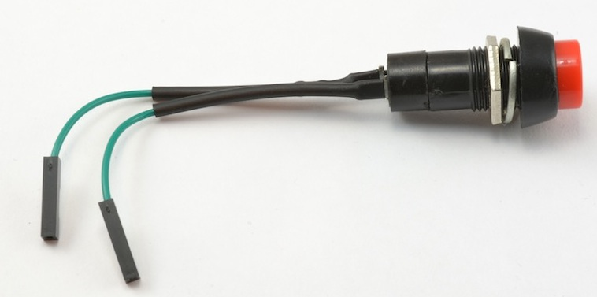
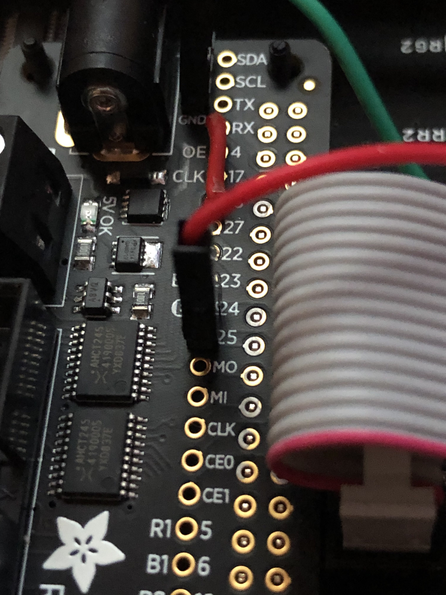

# SBIO PushButton
<!-- TOC -->

- [SBIO PushButton](#sbio-pushbutton)
    - [Features](#features)
    - [Software Requirements](#software-requirements)
    - [Hardware](#hardware)
    - [Preferences](#preferences)
    - [Notes for developing new display boards](#notes-for-developing-new-display-boards)
            - [Loops](#loops)
            - [time.sleep()](#timesleep)
    - [Known Issues](#known-issues)
    - [Roadmap](#roadmap)
    - [ChangeLog](#changelog)

<!-- /TOC -->

## Features
The SBIO PushButton addition to the NHL scoreboard was created to add a physical push button to your scoreboard and have it run within the scoreboard rather than a seperate process on your Pi.  With this button, you have the ability to reboot and poweroff your Raspberry Pi as well as trigger the display of a preferred board.  The timing of the reboot command and the poweroff command are configurable.  If you don't want to do a reboot or poweroff, there are settings to override those functions to lauch whatever process you want.  

When a reboot command is triggered, **REBOOT** in green will display on your scoreboard.  


When the poweroff command is triggered, **! HALT !** is displayed in red.  


When you are using the button to display a preferrered board, it will inject your preferred board into the loop for the different states.  Once your preferred board is done displaying, the loop will contiunue from the board that was interrupted.

> **_NOTE:_**  If you are using this PushButton functionality as part of the NHL LED Scoreboard, remove any other button scripts you may have as they will conflict with the scoreboard PushButton.

## Software Requirements
The PushButton code utilizes the [**gpiozero**](https://gpiozero.readthedocs.io/en/stable/index.html) library to access the GPIO pins on the Raspberry Pi.  This library is already installed on your Raspberry Pi if you are using Raspberry Pi Desktop image.  As the NHL Scoreboard requires a minimal image such as  Raspbian Lite or DietPi, you will need to do the following to use:

```
pi@raspberrypi:~$ sudo apt install python3-gpiozero
```
> **_NOTE:_**  The gpiozero library will be included as part of the [install.sh](../../scripts/install.sh).

The library uses the BCM pin numbering scheme and the PushButton code relies on that.  The numbering is as shown in the image below.  Anything marked GPIO can be used as a pin number.


## Hardware
In order for the PushButton to work properly, you need to have a momentary and non-latching PushButton.  You can get these buttons from any shop that sells a Raspberry Pi or Arduino.  Most buttons do not come with leads soldered on so you will have to make a choice on what you need.  The button that I selected for my build is the Squid Button (non-latching) [https://www.monkmakes.com/squid-button/](https://www.monkmakes.com/squid-button/).  


Squid Button
Button Mounted on Panel
Button connected to Pin 25 on bonnet

One side of your PushButton connects to a ground pin on your bonnet or HAT and the other connects to an open usable pin on the bonnet or HAT.  The pins available to use with the NHL Scoreboard are as follows:

| Bonnet | HAT |
---------|----------|
 2,3,7,8,9,10,11,14,15,19,25 | 7,8,9,10,11,14,15,19,25| 

If you are using a bonnet and connect your PushButton to pin #3, you also get a bonus that your PushButton will act as a true power button for your Raspberry Pi when it's shutdown.


## Preferences
The preferences for the PushButton resides in the sbio portion of the config.json under the pushbutton section.
``` json
"pushbutton": {
			"enabled": true,
			"bonnet": true,
			"pin": 25,
			"reboot_duration": 2,
            "reboot_override_process": "",
            "display_reboot": true,
			"poweroff_duration": 10,
            "poweroff_override_process": "",
            "display_halt": true,
            "state_triggered1": "clock",
            "state_triggered1_process": ""
		}
```
| Settings    | Type | Parameters  | Description                                                           |
|-------------|------|-------------|-----------------------------------------------------------------------|
| `enabled`     | Bool | true, false | Enable the PushButton thread  |
| `bonnet` | Bool | true, false | True = bonnet, False = HAT Used to check if you have selected correct pin |
| `pin` | INT | `25` | The **gpiozero** number pin your button is connected to |
| `reboot_duration` | INT | `2` | Number of seconds the PushButton must be held to trigger a reboot.  2 is the minimum value|
| `reboot_override_process` | String | `""` | Process or script to use instead of the default `/sbin/reboot` command.  Must have full path to script/process and no arguments for the process.  If you need arguments, wrap in a script. If this is blank or the command/process does not exist, falls back to the default|
| `display_reboot` | Bool | true,false | Show the word **REBOOT** in green on scoreboard when reboot triggered|
| `poweroff_duration` | INT | `10` | Number of seconds the PushButton must be held to trigger a poweroff.  Must be greater than `reboot_duration`.  If `reboot_duration` is higher than `poweroff_duration`, the code will swap them|
| `poweroff_override_process` | String | `""` | Process or script to use instead of the default `/sbin/poweroff` command.  Must have full path to script/process and no arguments for the process.  If you need arguments, wrap in a script.. If this is blank or the command/process does not exist, falls back to the default|
| `display_halt` | Bool | true,false | Show the word  **! HALT !** in red on scoreboard when poweroff triggered|
| `state_triggered1` | String | `"clock"` | The board you want displayed on button press.  If this is blank falls back to the default board which is `"clock"`. Current boards available are `team_summary`,`standings`,`scoreticker` and `clock`|
| `state_triggered1_process` | String | `""` | Process or script to use when a single press of the button happens to switch the board.  Must have full path to script/process and no arguments for the process.  If you need arguments, wrap in a script.|

## Notes for developing new display boards
There are two types of boards that can be created.  You can create a blocking board that will ignore the PushButton presses, or you can create a non-blocking board that will allow itself to be interrupted.  What you need to do as a developer to create a non-blocking board is listed below.

In order to utilize the PushButton to change to the different boards, there are a few things that are required for the board you design to allow it to be non-blocking.  The PushButton code utilizes Python threading and events to allow for interrupting the currently displayed boards.  When the PushButton receives a press event, it will set an event flag. 

In the `main.py`, there is an threading Event variable called sleepEvent that has been introduced.  This will need to be included as part of your `__init__` for your board class.  You must create a `self.sleepEvent` variable and then do a `self.sleepEvent.clear()`.
  
For example, here's the `team_summary.py` 
``` python 
class TeamSummary:
    def __init__(self, data, matrix,sleepEvent): 

        self.sleepEvent = sleepEvent
        self.sleepEvent.clear()
```
This will make sure that the sleepEvent is not set when the board is initialized.  

#### Loops
If you are using a while loop to draw your elements on the board, you need to change from using `while True:` to `while not self.sleepEvent.is_set():`  If you have a while loop that does comparison in it, and the `not self.sleepEvent.is_set()` as an `and` condition to your loop.  For example (again from `team_summary.py`):  
``` python 
while i > -(im_height - self.matrix.height) and not self.sleepEvent.is_set():
```

#### time.sleep()
If you were using `time.sleep()` as a method to pause your loop, you need to replace your `time.sleep()` with setting the `sleepEvent.wait()`

For example, instead of using `sleep(5)` , it now becomes `self.sleepEvent.wait(5)`

## Known Issues
1. If you press the button too quick after initially pressing it, you may get a flash of previously displayed board and then back to your preferred board.
2. Flipping to your preferred board if the team_summary board is running sometimes is delayed due to how the team_summary board is rendered.
3. If you interrupt the team_summary board with a button press, it may take a second or two to display your preferred board.

## Roadmap
* Add extra checks for multiple short term presses to stop or minimize issue #1
* Add a medium length duration or number of button presses with an option for another function or launch a process
* Better handling of processes with arguments
* ~~On reboot or poweroff, display on board that reboot or poweroff is happening.~~
  
## ChangeLog 
* V1.0 - Initial release March 2, 2020
